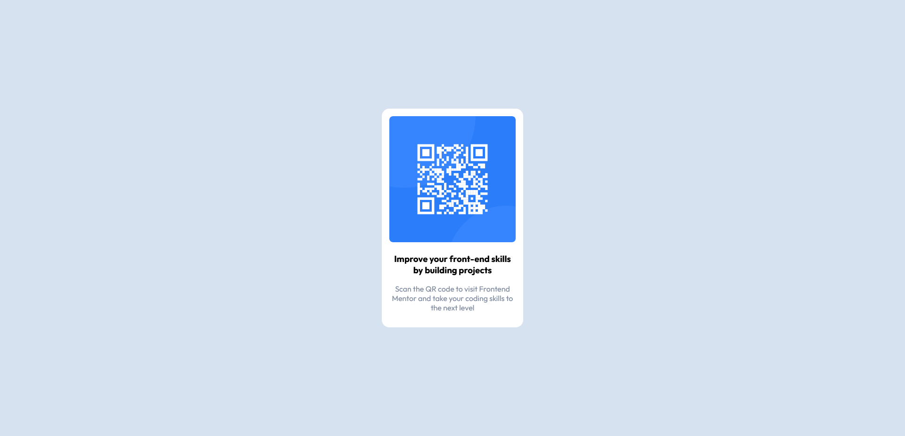

# FrontendMentroQRCodeChallenge
 QR Code challenge from Frontend Mentor
# Frontend Mentor - QR code component solution

This is a solution to the [QR code component challenge on Frontend Mentor](https://www.frontendmentor.io/challenges/qr-code-component-iux_sIO_H). Frontend Mentor challenges help you improve your coding skills by building realistic projects. 

## Table of contents

- [Overview](#overview)
  - [Screenshot](#screenshot)
  - [Links](#links)
- [My process](#my-process)
  - [Built with](#built-with)
  - [What I learned](#what-i-learned)
- [Author](#author)
- [Acknowledgments](#acknowledgments)


## Overview
This is the first, and most basic challenge i saw on Frontend Mentor. I plan to attempt to make some more of these as a profile. so this is primarily a test to see how the challenges work. 
### Screenshot



Full screen desktop version screenshot

### Links

- Solution URL: [Add solution URL here](https://your-solution-url.com)

## My process
Process for this one. 
Break down the main card elements and design the HTML
    model-container class - contains whole card
        qr-container class - the qr code image
        model-content class - text elements
after main components created i styled the elements
    max-width of 300 decided based on testing 
    small tweaks to model-content padding and sizings to make the card look as close as possible
    mobile and desktop remain the same, no need for media queries in this case
### Built with

- Semantic HTML5 markup (not much semantic here, but there is alt tags)
- Flexbox
- Mobile-first workflow

### What I learned

How to do a Frontend mentor challenge. As far as css goes, its small but the border-radius being smaller on the image vs the container is a really nice touch. I think this small detail made the most impact in making my design look the same as the challenge.

```css
.model-container{
    border-radius: 1rem;
}

.qr-container img{
    border-radius: .5rem;
}
```
## Author

- Frontend Mentor - [@matkinson01](https://www.frontendmentor.io/profile/matkinson01)

## Acknowledgments

This was 100% my code, but acknowledgements go to Frontenf mentor for posting the challenge, and giving me some things to work on for a profile. 